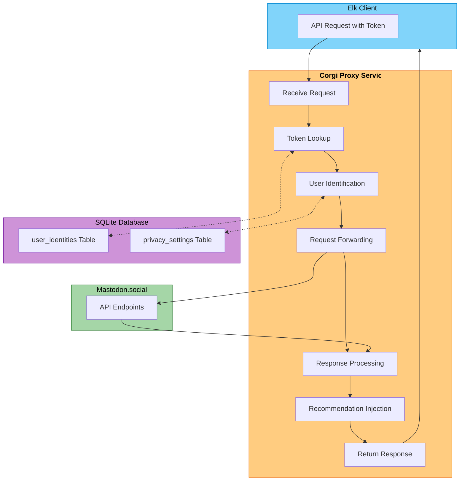

# Mastodon Proxy with Authenticated User

This document explains how the Mastodon proxy integration has been set up for the Corgi Recommender Service.

## Overview

We've configured the Corgi service to recognize and use a manually linked Mastodon token. This allows for testing the proxy functionality with Elk without requiring a full OAuth flow.

## Implementation Details

### Database Configuration

We created a SQLite database (`corgi_demo.db`) with the following tables:
- `user_identities`: Stores user-to-Mastodon mappings and tokens
- `privacy_settings`: Stores privacy preferences for users

### User Configuration

A user has been registered with the following details:
- **User ID**: `demo_user`
- **Instance**: `mastodon.social`
- **Access Token**: `_Tb8IUyXBZ5Y8NmUcwY0-skXWQgP7xTVMZCFkqvZRIc`
- **Privacy Level**: `full` (allows personalization)

### Server Configuration

We modified the server to:
1. Use a SQLite database instead of PostgreSQL for easier testing
2. Override the token lookup function to use our SQLite database
3. Ensure proxy requests preserve Authorization headers

### Integration with Elk

For Elk to work with this proxy:
1. Configure Elk to point to the Corgi proxy URL: `http://localhost:8000/api/v1/proxy`
2. Set up the Authorization header with the token: `Bearer _Tb8IUyXBZ5Y8NmUcwY0-skXWQgP7xTVMZCFkqvZRIc`

## How It Works



1. When Elk sends a request to the Corgi proxy, it includes the token in the Authorization header
2. The proxy looks up the token in the `user_identities` table in the SQLite database
3. If found, it identifies the user and loads their privacy settings
4. It forwards the request to the appropriate Mastodon instance (mastodon.social)
5. When Mastodon responds, the Corgi service processes the response
6. For timeline requests, personalized recommendations are injected based on user preferences
7. The enhanced response is returned to the Elk client

## Scripts Created

1. `simplified_setup.py`: Creates the SQLite database and links the Mastodon user
2. `run_proxy_server.py`: Runs the Corgi server with SQLite support on port 8000
3. `test_token.py`: Tests that the token is properly recognized by the proxy

## Running the Server

To start the server with the token support:

```bash
python3 run_proxy_server.py
```

This will start the server on port 8000 and enable the token authentication for proxy requests.

## Testing

You can test the token recognition with:

```bash
python3 test_token.py
```

This will send requests to the proxy debug endpoints and show if the token is properly recognized.

## Future Improvements

For a full implementation:
1. Implement the complete OAuth flow for Mastodon authentication
2. Store tokens securely with encryption
3. Add refreshing of tokens when they expire
4. Implement proper CORS handling for web clients
5. Add more robust error handling for network issues