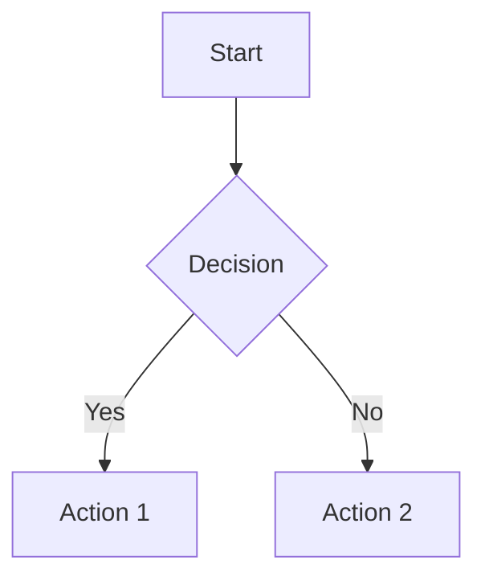

# Documentation Style Guide

This guide establishes styling and formatting standards for the Corgi Recommender Service documentation. Following these guidelines ensures a consistent, high-quality documentation experience.

## Heading Hierarchy

Use a logical heading structure that follows this pattern:

- `# H1`: Page title, only use once per page
- `## H2`: Major sections 
- `### H3`: Subsections
- `#### H4`: Minor subsections when needed
- Never skip a level (e.g., don't go from H2 to H4)

## Code Blocks

Always specify the language for syntax highlighting:

```python
# Python code example
def example_function():
    return "Hello, World!"
```

```json
{
  "key": "value",
  "array": [1, 2, 3]
}
```

```bash
# Shell commands
echo "Hello, World!"
```

Use 4-space indentation consistently in code blocks.

## Admonitions

Use Material for MkDocs admonitions for callouts instead of custom HTML:

!!! note "Note Title"
    Important information that users should know about.

!!! tip "Tip Title"
    Helpful advice for users.

!!! warning "Warning Title"
    Critical information that users should be careful about.

!!! danger "Danger Title"
    Information about actions with potentially severe consequences.

!!! example "Example Title"
    An example demonstrating a concept.

### When to Use Each Admonition Type

- **note**: For general information that supplements the main content
- **tip**: For suggestions and best practices
- **info**: For background information and context
- **warning**: For potential pitfalls and important cautions
- **danger**: For actions that might cause data loss or security issues
- **example**: For practical demonstrations
- **question**: For FAQ-style content
- **success**: For confirming successful operations

## Tables

Use consistent column alignment and always include header separators:

| Column 1 | Column 2 | Column 3 |
|----------|:--------:|----------:|
| Left     | Center   | Right    |
| Aligned  | Aligned  | Aligned  |

Always use table header separators with at least 3 dashes (`---`).

## Mermaid Diagrams

Use Mermaid.js for diagrams with consistent styling:



Use consistent node shapes and styles:
- Rectangular nodes for processes: `[Process]`
- Diamond nodes for decisions: `{Decision}`
- Rounded nodes for start/end: `(Start/End)`

## Lists

Use consistent list formatting:

- Unordered lists use dash (`-`)
- Ordered lists use numbers (`1.`)
- Indent nested lists with 4 spaces

Example:

1. First ordered item
2. Second ordered item
    - Unordered sub-item
    - Another unordered sub-item
3. Third ordered item

## Links

Use descriptive link text:

- ✅ Do: [View the API documentation](api-documentation.md)
- ❌ Don't: Click [here](api-documentation.md) for API documentation

## Images

Include alt text and consistent styling:

```markdown

```

Add captions when helpful:

```markdown
<figure markdown>
  
  <figcaption>Caption describing the image</figcaption>
</figure>
```

## Callouts and Blockquotes

For simple blockquotes, use the standard Markdown syntax:

> This is a blockquote providing a standout piece of information.

## File Paths and Variables

Use code formatting for:
- File paths: `config/database.yml`
- Variables: `CORGI_DB_URL`
- Code identifiers: `UserAlias`

## Tabs

Use tabs for showing multiple alternatives:

=== "Python"
    ```python
    print("Hello, World!")
    ```

=== "JavaScript"
    ```javascript
    console.log("Hello, World!");
    ```

## Cross-References

Use relative links for internal documentation references:

```markdown
See the [Database Schema](database/schema.md) for more information.
```

## Terminology

Use consistent terminology throughout the documentation:

- "Database model" (not "database table")
- "SQLAlchemy ORM" (not just "ORM" or "Object-Relational Mapping")
- "Privacy level" (not "privacy setting" or "privacy option")

## API Documentation

For API endpoints, follow this structure:

```markdown
### Endpoint Name

**URL**: `/api/v1/endpoint`

**Method**: `GET`

**Auth required**: Yes

**Parameters**:

| Parameter | Type   | Required | Description          |
|-----------|--------|----------|----------------------|
| user_id   | string | Yes      | The user identifier  |

**Example Request**:

```curl
curl -X GET "https://api.example.com/api/v1/endpoint?user_id=123" \
  -H "Authorization: Bearer TOKEN"
```

**Example Response**:

```json
{
  "status": "success",
  "data": {
    "key": "value"
  }
}
```

**Error Responses**:

- `401 Unauthorized`: Invalid or missing authentication
- `404 Not Found`: Resource not found
```

By following these guidelines, we ensure a consistent, high-quality documentation experience for our users.