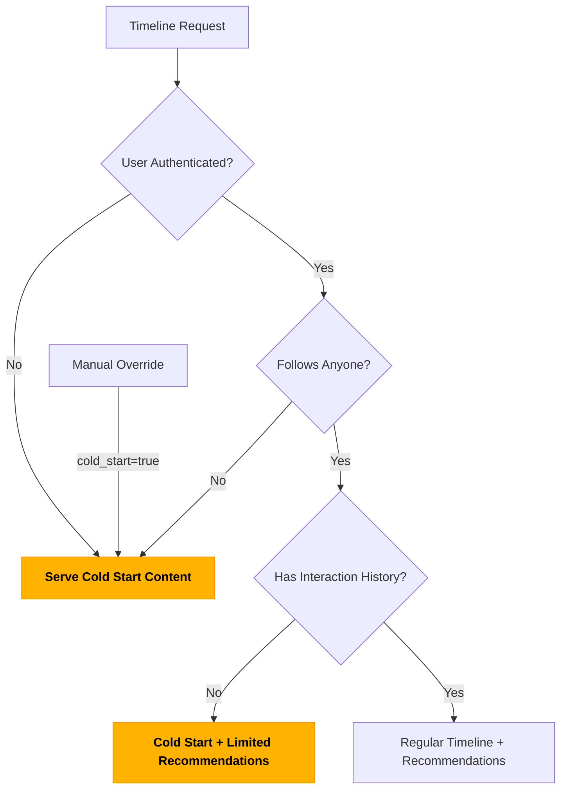
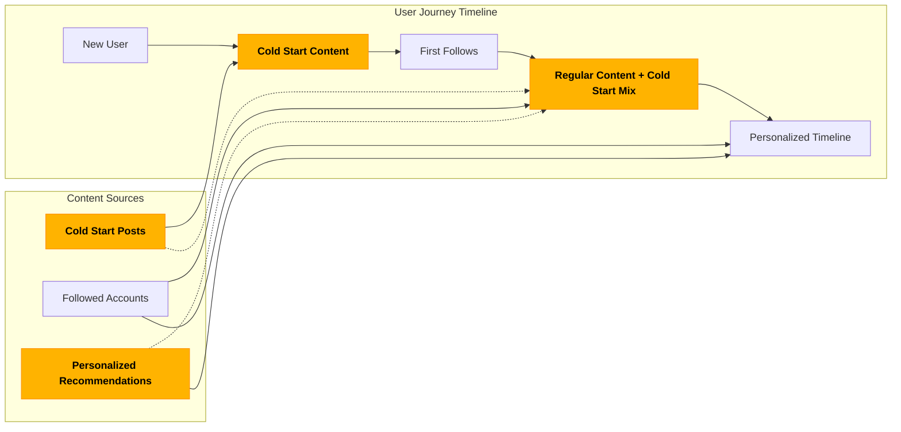

# Cold Start Strategy

The Cold Start Strategy is a key feature of the Corgi Recommender Service that helps solve the "cold start problem" in recommendation systems - the challenge of providing relevant content to new users who have no interaction history.

## What is the Cold Start Strategy?

When a new user joins the Fediverse or connects to Corgi, they typically have no follows and no personalized timeline content. Instead of showing an empty timeline, Corgi's Cold Start Strategy provides these users with a curated set of high-quality posts across diverse topics.

The cold start posts:
- Cover a wide range of categories (technology, art, science, literature, etc.)
- Are designed to be broadly appealing and engagement-worthy
- Help new users discover interesting content and accounts to follow
- Provide immediate value to users without requiring them to first build a network

## How is it Triggered?

The Cold Start Strategy activates automatically in three scenarios:

1. **New Users**: When a user follows no one (determined by querying their instance's API)
2. **Anonymous Users**: When no user authentication is provided (ensuring timelines are never blank)
3. **Manual Testing**: When explicitly requested via the `cold_start=true` query parameter



```python
# Simplified logic from routes/proxy.py
cold_start_mode = force_cold_start  # From cold_start=true parameter

if COLD_START_ENABLED and not cold_start_mode and user_token:
    from utils.follows import user_follows_anyone
    
    # Check if user follows anyone
    follows_anyone = user_follows_anyone(user_token)
    
    if not follows_anyone:
        cold_start_mode = True
        # User follows no one - trigger cold start mode
```

## Route and Parameter Changes

The cold start functionality is integrated into several routes:

### Primary Route: `/api/v1/timelines/home`

This is the main endpoint where cold start content is served:

```
GET /api/v1/timelines/home
```

Query parameters:
- `cold_start=true` - Explicitly force cold start mode (useful for testing)
- `limit=20` - Control the number of posts returned (default: 20)

### Augmented Timeline: `/api/v1/timelines/home/augmented`

This endpoint supports blending recommendations with regular timeline content:

```
GET /api/v1/timelines/home/augmented
```

Query parameters:
- `inject_recommendations=true` - Explicitly control recommendation injection
- `blend_ratio=0.3` - Control the ratio of recommendations to regular posts (default: 0.3 or 30%)

## Configuration Options

The Cold Start Strategy can be configured using the following environment variables:

| Variable | Description | Default |
|----------|-------------|---------|
| `COLD_START_ENABLED` | Enable/disable the cold start feature | `true` |
| `COLD_START_POSTS_PATH` | Path to the JSON file containing cold start posts | `data/cold_start_posts.json` |
| `COLD_START_POST_LIMIT` | Maximum number of cold start posts to include | `30` |
| `ALLOW_COLD_START_FOR_ANONYMOUS` | Enable cold start content for unauthenticated users | `true` |

## Cold Start Posts Format

The cold start posts are defined in a JSON file with the following structure:

```json
[
  {
    "id": "cold_start_post_1",
    "content": "<p>Welcome to the Fediverse! This decentralized social network connects people...</p>",
    "created_at": "2025-04-19T12:00:00.000Z",
    "account": {
      "id": "corgi_official",
      "username": "corgi_official",
      "display_name": "Corgi Recommender",
      "url": "https://example.com/@corgi_official"
    },
    "language": "en",
    "favourites_count": 350,
    "reblogs_count": 120,
    "replies_count": 25,
    "tags": ["welcome", "introduction", "fediverse"],
    "category": "welcome"
  },
  // Additional posts...
]
```

Each post is marked with additional properties when served:
- `is_cold_start: true` - Identifies it as a cold start post
- `is_real_mastodon_post: false` - Indicates it's not from a real Mastodon instance
- `is_synthetic: true` - Marks it as synthetic content

## Tracking User Engagement

Corgi tracks user interactions with cold start posts to:
- Measure which content types engage new users
- Help develop personalized recommendations as users begin to interact
- Analyze the effectiveness of different cold start content categories

This data helps continuously improve the cold start experience for future users.

## Unauthenticated Support

The Cold Start Strategy ensures that even unauthenticated users always receive content in their timeline:

- When `/api/v1/timelines/home` is accessed without authentication, the system serves cold start content
- This feature ensures timelines are never blank, even for anonymous sessions
- The system logs these anonymous sessions with a special flag: `anonymous=true`
- Unlike authenticated users, anonymous users always receive the default content selection rather than personalized recommendations

This behavior can be controlled with the following configuration option:

```
ALLOW_COLD_START_FOR_ANONYMOUS=true
```

Setting this to `false` will revert to the standard behavior of returning an empty timeline for unauthenticated requests.

## Transitioning Away from Cold Start

As users begin to follow accounts and interact with content, their timeline naturally transitions from cold start content to:
1. Posts from accounts they follow
2. Personalized recommendations based on their interactions

This creates a smooth onboarding experience that guides users from their first interaction to a fully personalized timeline.

