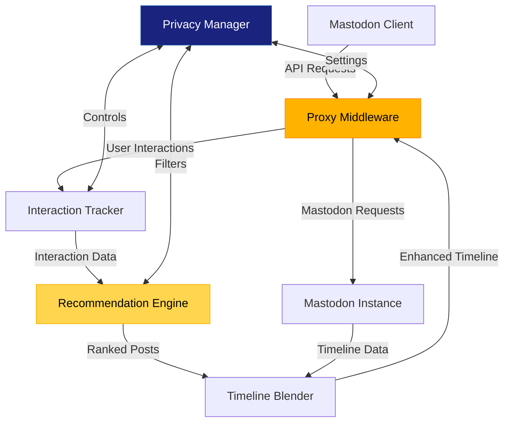

# How Corgi Works

Corgi provides personalized recommendations for Mastodon users while respecting privacy preferences. This page explains how the core components work together.

## Architecture Overview

Corgi consists of several interconnected components that work together to provide a seamless recommendation experience:



### Key Components

1. **Proxy Middleware** - Intercepts Mastodon API requests and forwards them to your instance
2. **Interaction Tracker** - Records favorites, boosts, and other engagement signals
3. **Recommendation Engine** - Analyzes interactions to determine post relevance
4. **Timeline Blender** - Integrates recommended posts into standard Mastodon timelines
5. **Privacy Manager** - Enforces user-defined privacy settings across the system

## Proxy Architecture

The proxy is Corgi's most powerful feature. It allows any Mastodon client to benefit from personalized recommendations without modification.

### Transparent Middleware

When a client makes a request to its Mastodon server, the request passes through Corgi's proxy:

1. Client sends request to Corgi (e.g., `GET /api/v1/timelines/home`)
2. Corgi identifies the user's Mastodon instance
3. Corgi forwards the request to that instance, including authentication
4. Mastodon instance returns the original response
5. For timeline endpoints only, Corgi enhances the response with recommendations
6. Enhanced response is returned to the client

<div class="corgi-callout">
  <div class="corgi-callout-title">
    <svg xmlns="http://www.w3.org/2000/svg" viewBox="0 0 24 24" width="24" height="24" fill="currentColor"><path d="M12 22C6.477 22 2 17.523 2 12S6.477 2 12 2s10 4.477 10 10-4.477 10-10 10zm0-2a8 8 0 1 0 0-16 8 8 0 0 0 0 16zM11 7h2v2h-2V7zm0 4h2v6h-2v-6z"/></svg>
    Infrastructure Note
  </div>
  <p>The proxy architecture means users need to trust their Corgi instance, since all API traffic (including authentication) passes through it. We recommend setting up your own instance for maximum privacy and security.</p>
</div>

### Instance Resolution

Corgi determines which Mastodon instance to forward requests to in this order:

1. `X-Mastodon-Instance` header in the request
2. `instance` query parameter 
3. Database lookup based on the user's OAuth token
4. Default instance from configuration

## Pseudonymous Identity

Corgi uses pseudonymous identifiers to track user preferences while respecting privacy:

### User Aliasing

Corgi generates a user alias by:
1. Taking the user's ID or OAuth token
2. Applying a SHA-256 hash with a site-specific salt
3. Storing all preference data against this pseudonymous ID

```python
def generate_user_alias(user_id):
    # Hash the user ID with a site-specific salt
    hash_input = f"{user_id}{SITE_SALT}"
    return hashlib.sha256(hash_input.encode()).hexdigest()
```

This means:
- Even if data is exposed, it cannot be traced back to specific users
- The same user gets the same alias on each visit
- Different Corgi instances generate different aliases for the same user

## Recommendation Algorithm

Corgi's recommendation engine analyzes user interactions to rank content:

### Ranking Factors

Each post receives a score based on three key factors:

1. **Author Preference** (40%) - How much the user interacts with posts from this author
2. **Content Engagement** (30%) - Overall popularity metrics (favorites, boosts, replies)
3. **Recency** (30%) - How recently the post was created, with exponential decay

### Score Calculation

```python
def calculate_ranking_score(post, user_interactions):
    author_score = get_author_preference_score(user_interactions, post['author_id'])
    engagement_score = get_content_engagement_score(post)
    recency_score = get_recency_score(post)
    
    weights = ALGORITHM_CONFIG['weights']
    overall_score = (
        weights['author_preference'] * author_score +
        weights['content_engagement'] * engagement_score +
        weights['recency'] * recency_score
    )
    
    # Determine the primary reason for recommendation
    reason = "Recommended for you"
    max_factor = max(
        (author_score * weights['author_preference'], "From an author you might like"),
        (engagement_score * weights['content_engagement'], "Popular with other users"),
        (recency_score * weights['recency'], "Recently posted")
    )
    
    _, reason = max_factor
    
    return overall_score, reason
```

### Transparent Reasoning

Each recommended post includes a human-readable explanation for why it's being shown:

- "From an author you might like"
- "Popular with other users" 
- "Recently posted"

This helps users understand and refine their recommendations.

## Timeline Blending

When enhancing a home timeline, Corgi blends recommendations with the original timeline:

### Blending Process

1. Retrieve the user's standard home timeline from their Mastodon instance
2. Fetch personalized recommendations from the recommendation engine
3. Distribute recommendations throughout the timeline based on the blend ratio
4. Add metadata to recommended posts (`is_recommendation: true`)
5. Return the enhanced timeline to the client

<div class="corgi-card">
  <h3 style="margin-top: 0;">💡 Blend Ratio</h3>
  <p>The default blending ratio is 30% recommendations to 70% standard timeline posts. This ratio can be configured by the user or administrator to control how many recommendations appear.</p>
</div>

## Privacy Levels

Corgi gives users control over how much data is collected through three privacy levels:

| Level | Description | Data Collection | Personalization |
|-------|-------------|-----------------|-----------------|
| `full` | Complete personalization | Stores all interactions with pseudonymous ID | Full personalized recommendations |
| `limited` | Basic personalization | Stores only aggregated statistics, no individual interactions | Limited personalization using aggregated preferences |
| `none` | No tracking | No data collection | No personalization (standard timeline only) |

Users can change their privacy level at any time through the API or client settings.

<div class="corgi-callout">
  <div class="corgi-callout-title">
    <svg xmlns="http://www.w3.org/2000/svg" viewBox="0 0 24 24" width="24" height="24" fill="currentColor"><path d="M12 22C6.477 22 2 17.523 2 12S6.477 2 12 2s10 4.477 10 10-4.477 10-10 10zm0-2a8 8 0 1 0 0-16 8 8 0 0 0 0 16zm-1-5h2v2h-2v-2zm2-1.645V14h-2v-1.5a1 1 0 0 1 1-1 1.5 1.5 0 1 0-1.471-1.794l-1.962-.393A3.501 3.501 0 1 1 13 13.355z"/></svg>
    Privacy by Default
  </div>
  <p>New users start with the <code>limited</code> privacy level unless they explicitly opt in to full data collection.</p>
</div>

## Portable Identity

One of Corgi's key benefits is portability across Mastodon instances:

### Cross-Instance Continuity

Since Corgi operates as a separate service:

1. Your recommendation profile stays with you even if you change Mastodon instances
2. Your interactions across multiple instances contribute to the same preference profile
3. Recommendations can incorporate content from the broader Fediverse, not just your home instance

This creates a consistent, personalized experience regardless of which Mastodon server you call home.

## Next Steps

- [Privacy Design](concepts/privacy.md) - Detailed explanation of privacy protections
- [Proxy Architecture](concepts/proxy.md) - In-depth guide to the proxy middleware
- [Recommendation Engine](concepts/recommendations.md) - Technical details of the ranking algorithm