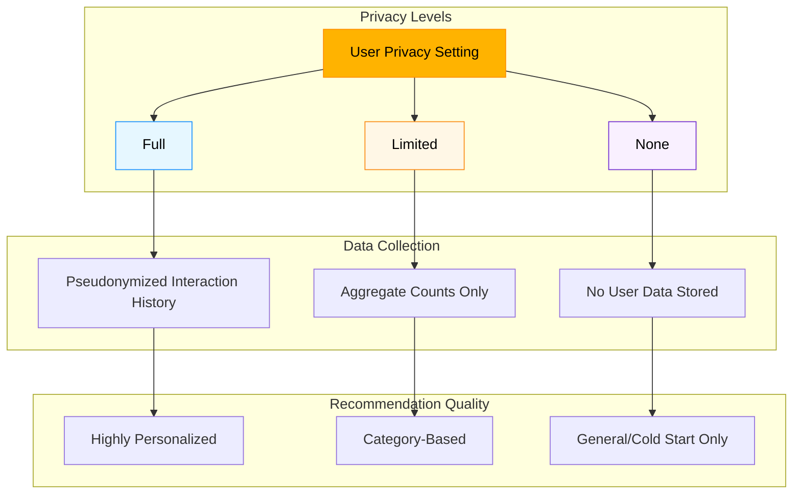
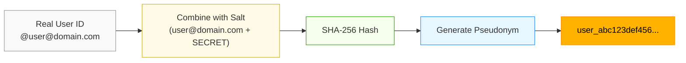

# Privacy Design

Corgi was built with privacy as a core principle. This document explains how we protect user data while still providing personalized recommendations.

## Privacy Philosophy

Our approach to privacy is guided by these principles:

1. **Minimum Necessary Collection** - Only collect data essential for recommendations
2. **User Control** - Clear privacy settings with meaningful options
3. **Pseudonymous Identity** - Avoid storing personally identifiable information
4. **Local Processing** - Keep data within your Corgi instance
5. **Transparency** - Be clear about what data is collected and how it's used

## User Privacy Levels

Corgi gives users three distinct privacy levels that control data collection and personalization:



### Full Tracking

```json
{
  "tracking_level": "full"
}
```

With full tracking enabled:

- All interactions (favorites, boosts, etc.) are stored with pseudonymous user IDs
- Detailed content preferences are tracked (authors, topics)
- Maximum personalization is provided
- Data is retained according to the configured retention period

### Limited Tracking

```json
{
  "tracking_level": "limited"
}
```

With limited tracking (the default):

- Only aggregated statistics are stored (e.g., "User X has favorited 5 posts from Author Y")
- Individual interactions are not retained after aggregation
- Basic personalization is still possible
- Reduced recommendation quality but increased privacy

### No Tracking

```json
{
  "tracking_level": "none"
}
```

With no tracking:

- No user data is collected
- No personal data is stored
- No personalization is provided
- Timeline requests pass through without enhancement

<div class="corgi-callout">
  <div class="corgi-callout-title">
    <svg xmlns="http://www.w3.org/2000/svg" viewBox="0 0 24 24" width="24" height="24" fill="currentColor"><path d="M12 22C6.477 22 2 17.523 2 12S6.477 2 12 2s10 4.477 10 10-4.477 10-10 10zm0-2a8 8 0 1 0 0-16 8 8 0 0 0 0 16zM11 7h2v2h-2V7zm0 4h2v6h-2v-6z"/></svg>
    Privacy Default
  </div>
  <p>All new users start with <code>limited</code> tracking unless they explicitly opt into <code>full</code> tracking.</p>
</div>

## Identity Pseudonymization

To protect user identity while enabling personalization, Corgi uses pseudonymous identifiers:



### User Aliasing

When a user interacts with Corgi, their identity is pseudonymized:

```python
def generate_user_alias(user_id):
    # Combine the user ID with a site-specific salt
    hash_input = f"{user_id}{SITE_SALT}"
    # Generate a SHA-256 hash
    return hashlib.sha256(hash_input.encode()).hexdigest()
```

This approach ensures:

- The same user gets the same alias on each visit
- Different Corgi instances generate different aliases for the same user
- The original user ID cannot be derived from the alias without the salt

All user data in the database is stored against this pseudonymous alias, not the original user ID.

## Data Minimization

Corgi only stores the minimum necessary data for recommendations:

### Interaction Data

For users with `full` tracking, each interaction contains:

```json
{
  "user_alias": "8f7d8a98c7d987f9a87dc987a9d87f98a7",
  "post_id": "109876543211234567",
  "action_type": "favorite",
  "created_at": "2025-03-15T14:22:11.000Z",
  "context": {
    "source": "timeline_home"
  }
}
```

Note that we don't store:
- Post content
- Author details
- User's real identity
- IP address or device information

### Content Metadata

For ranked posts, we store:

```json
{
  "post_id": "109876543211234567",
  "author_id": "12345",
  "author_name": "techblogger",
  "created_at": "2025-03-15T14:22:11.000Z",
  "interaction_counts": {
    "favorites": 43,
    "reblogs": 28,
    "replies": 12
  }
}
```

The full post content is fetched from the Mastodon API at request time, not stored in Corgi.

## Data Retention

Corgi implements time-limited retention of user data:

- Interaction data is kept for 90 days by default (configurable)
- Older interactions are automatically purged
- User profile data is retained until the user deletes their account
- Users can request immediate deletion of all their data

## Proxy Privacy Considerations

Since Corgi acts as a proxy, it processes all requests between the client and Mastodon, including authentication:

### Authentication Handling

- OAuth tokens are never logged
- Tokens are passed through to Mastodon without modification
- Tokens are not stored unless explicitly linked (for instance resolution)
- If stored, tokens are encrypted at rest

### Request Privacy

- Request URLs and parameters are only logged at debug level
- Response bodies are never logged
- Sensitive headers are redacted in logs

<div class="corgi-card">
  <h3 style="margin-top: 0;">🔒 Self-Hosting for Maximum Privacy</h3>
  <p>For maximum privacy, we recommend self-hosting your own Corgi instance. This ensures that all your data stays within your control.</p>
</div>

## Data Access and Deletion

Users have full control over their data:

### Accessing Your Data

Users can retrieve all data associated with their account:

```bash
curl -X GET "https://api.corgi-recs.io/api/v1/privacy/export" \
  -H "Authorization: Bearer YOUR_API_KEY"
```

### Deleting Your Data

To delete all user data:

```bash
curl -X DELETE "https://api.corgi-recs.io/api/v1/privacy/data" \
  -H "Authorization: Bearer YOUR_API_KEY"
```

This permanently removes all user data, including:
- Interaction history
- Preference profiles
- Account links
- Rankings and recommendations

## Auditing and Compliance

Corgi's privacy practices are transparent and auditable:

- The [source code](https://github.com/andrewnordstrom/corgi-recommender-service) is open for review
- Data processing is documented in comments and this guide
- Regular privacy audits are conducted
- We welcome security researchers to review our privacy practices

## Privacy Settings API

Users can control their privacy settings through the API:

```bash
# Get current privacy settings
curl -X GET "https://api.corgi-recs.io/api/v1/privacy?user_id=your_user_id" \
  -H "Authorization: Bearer YOUR_API_KEY"

# Update privacy settings
curl -X POST "https://api.corgi-recs.io/api/v1/privacy" \
  -H "Authorization: Bearer YOUR_API_KEY" \
  -H "Content-Type: application/json" \
  -d '{
    "user_id": "your_user_id",
    "tracking_level": "limited"
  }'
```

For full API details, see the [Privacy Settings API Reference](../endpoints/privacy.md).