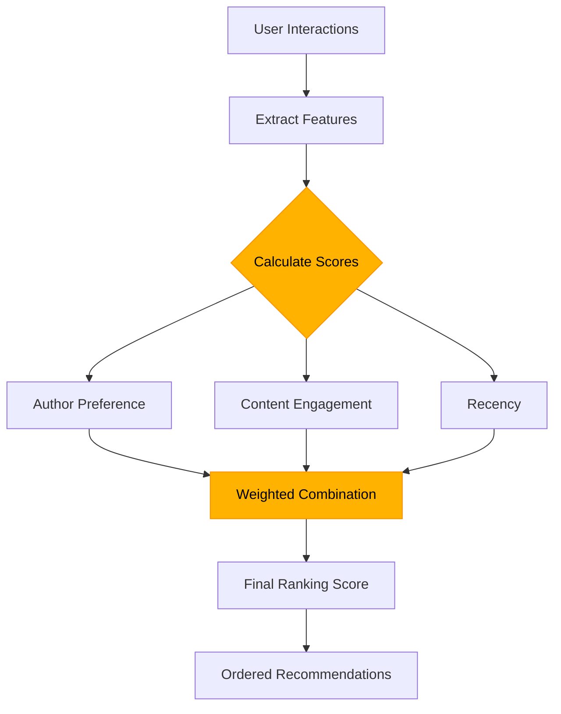
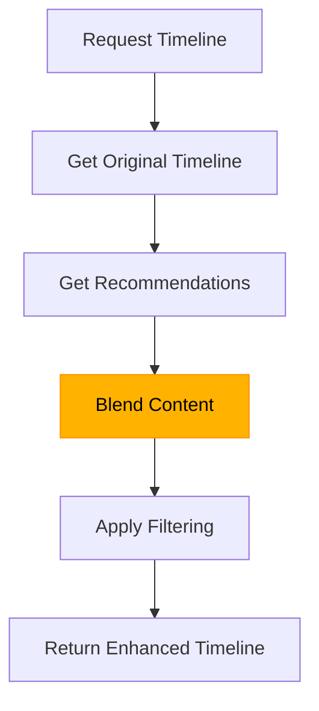
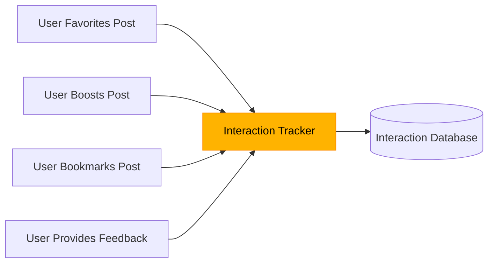

# Recommendation Engine

Corgi's recommendation engine is the core of the service, analyzing user interactions to provide personalized content suggestions. This document explains how the engine works and how you can optimize it.

## Ranking Algorithm

The recommendation engine uses a multi-factor ranking algorithm to score content based on user preferences and global engagement:



### Ranking Factors

Each post is scored based on three key factors:

#### 1. Author Preference (40%)

Measures how much a user interacts with content from specific authors:
- Calculated based on the user's history of favorites, boosts, and other interactions
- Higher scores for authors the user consistently engages with
- Adjusted for negative feedback (e.g., "less like this")
- Applies a sigmoid function to normalize scores

```python
def get_author_preference_score(user_interactions, author_id):
    # Count positive and negative interactions with author's content
    author_interactions = {
        'positive': count_of_positive_interactions,
        'negative': count_of_negative_interactions,
        'total': total_interactions
    }
    
    # Calculate positive ratio
    positive_ratio = author_interactions['positive'] / (author_interactions['total'] + 0.001)
    
    # Apply sigmoid function to create a smooth 0-1 range
    preference_score = 1 / (1 + math.exp(-5 * (positive_ratio - 0.5)))
    
    return max(preference_score, 0.1)  # Minimum score is 0.1
```

#### 2. Content Engagement (30%)

Evaluates the post's overall popularity in the community:
- Based on favorite counts, boost counts, and reply counts
- Uses logarithmic scaling to prevent very popular posts from dominating
- Normalized to a 0-1 range for consistent weighting

```python
def get_content_engagement_score(post):
    # Extract counts with fallbacks to 0
    favorites = int(counts.get('favorites', 0))
    reblogs = int(counts.get('reblogs', 0))
    replies = int(counts.get('replies', 0))
    
    # Sum with logarithmic scaling
    total = favorites + reblogs + replies
    return math.log(total + 1) / 10.0  # Normalize to roughly 0-1 range
```

#### 3. Recency (30%)

Measures how fresh the content is:
- Exponential decay based on post age
- Newer posts receive higher scores
- Configurable decay factor (default: 3 days)
- Ensures score doesn't fall below a minimum threshold

```python
def get_recency_score(post):
    # Calculate age in days
    age_days = (now - post['created_at']).total_seconds() / (24 * 3600)
    
    # Exponential decay based on age
    decay_factor = CONFIG['time_decay_days']
    recency_score = math.exp(-age_days / decay_factor)
    
    # Minimum score for older posts
    return max(recency_score, 0.2)
```

### Combined Scoring

The final ranking score combines these factors with configurable weights:

```python
def calculate_ranking_score(post, user_interactions):
    # Calculate individual feature scores
    author_score = get_author_preference_score(user_interactions, post['author_id'])
    engagement_score = get_content_engagement_score(post)
    recency_score = get_recency_score(post)
    
    # Combine scores using weights
    weights = CONFIG['weights']
    overall_score = (
        weights['author_preference'] * author_score +
        weights['content_engagement'] * engagement_score +
        weights['recency'] * recency_score
    )
    
    # Determine primary reason for recommendation
    reason = max(
        (author_score * weights['author_preference'], "From an author you might like"),
        (engagement_score * weights['content_engagement'], "Popular with other users"),
        (recency_score * weights['recency'], "Recently posted")
    )[1]
    
    return overall_score, reason
```

## Timeline Blending

Corgi seamlessly integrates recommendations into user timelines while preserving the natural flow of content.

### Blending Approach

The timeline blending process works like this:



1. When a user requests a timeline (home, public, hashtag, etc.), Corgi first retrieves the original timeline from the Mastodon server
2. In parallel, Corgi gets personalized recommendations for the user
3. Recommendations are blended with the original content at a configurable ratio (default 30%)
4. Blended content is filtered to remove duplicates and maintain chronological order where appropriate
5. The enhanced timeline is returned with recommendation metadata

### Blend Ratio Configuration

The blend ratio determines how many recommendations appear in the timeline:

```bash
# Set timeline blend ratio (0.0 to 1.0)
curl -X POST "https://api.corgi-recs.io/api/v1/proxy/config" \
  -H "Authorization: Bearer YOUR_API_KEY" \
  -H "Content-Type: application/json" \
  -d '{
    "recommendation_blend_ratio": 0.3
  }'
```

A ratio of 0.3 means approximately 30% of content will be recommendations, while 70% comes from the original timeline.

### Timeline Types

Different timeline types receive different blending approaches:

| Timeline Type | Default Blend Ratio | Notes |
|---------------|---------------------|-------|
| Home | 0.3 | Balanced approach |
| Public | 0.5 | Higher ratio for discovery |
| Hashtag | 0.2 | Lower ratio to maintain topic focus |
| User | 0.0 | No blending by default |

### Timeline Integrity

To maintain timeline integrity, Corgi ensures:

1. Home timeline posts from followed accounts are never removed
2. Chronological order is preserved when sorting by time
3. Duplicate posts are eliminated
4. Recommendations are clearly marked with explanation badges

## Recommendation Process

The complete recommendation process involves several steps:

### 1. User Interaction Collection



Corgi tracks these interaction types:
- `favorite` - User favorites a post
- `bookmark` - User bookmarks a post
- `reblog` - User boosts/reblogs a post
- `more_like_this` - User explicitly requests similar content
- `less_like_this` - User explicitly requests less similar content

### 2. Candidate Selection

Before ranking, the system selects candidate posts:

```python
def get_candidate_posts(
    limit=100,
    days_limit=7,
    exclude_post_ids=None,
    include_synthetic=False
):
    # Query recent posts from database
    # Exclude posts the user has already interacted with
    # Optionally include synthetic posts if real post count is low
    # Return list of candidate posts
```

The candidate selection process:
1. Prioritizes recent posts (default: last 7 days)
2. Excludes posts the user has already seen or interacted with
3. Includes a mix of posts from followed and non-followed authors
4. Can include synthetic posts when real post count is low (configurable)

### 3. Ranking and Filtering

```python
def generate_rankings_for_user(user_id):
    # Get user's interaction history
    user_interactions = get_user_interactions(user_id, days_limit=30)
    
    # Get candidate posts (excluding already seen posts)
    seen_post_ids = [interaction['post_id'] for interaction in user_interactions]
    candidate_posts = get_candidate_posts(
        limit=CONFIG['max_candidates'],
        days_limit=14,
        exclude_post_ids=seen_post_ids
    )
    
    # Calculate ranking scores for each post
    ranked_posts = []
    for post in candidate_posts:
        score, reason = calculate_ranking_score(post, user_interactions)
        
        # Include only posts with reasonable scores
        if score > 0.1:
            post['ranking_score'] = score
            post['recommendation_reason'] = reason
            ranked_posts.append(post)
    
    # Sort by ranking score (descending)
    ranked_posts.sort(key=lambda x: x['ranking_score'], reverse=True)
    
    # Store rankings and return
    store_rankings(user_id, ranked_posts)
    return ranked_posts
```

### 4. Human-Readable Explanation

Each recommendation includes a human-readable reason:

```json
{
  "id": "109876543211234567",
  "content": "<p>Just published a new blog post about sustainable tech!</p>",
  "ranking_score": 0.87,
  "recommendation_reason": "From an author you might like",
  "is_recommendation": true
}
```

The three primary recommendation reasons are:
- "From an author you might like" (author preference dominant)
- "Popular with other users" (engagement dominant)
- "Recently posted" (recency dominant)

## Tuning the Algorithm

The recommendation algorithm can be tuned through configuration:

### Weight Configuration

```json
{
  "weights": {
    "author_preference": 0.4,
    "content_engagement": 0.3,
    "recency": 0.3
  },
  "time_decay_days": 3,
  "min_score_threshold": 0.1,
  "max_candidates": 200,
  "include_synthetic": false
}
```

### Recommendation Quality Factors

Several factors affect recommendation quality:

1. **Interaction Volume** - More user interactions = better recommendations
2. **Content Variety** - Diverse content pool improves recommendation quality
3. **Recency Balance** - How much to favor new vs. established content
4. **Author vs. Content** - Balancing author-based vs. content-based recommendations
5. **Time Horizon** - How far back to look for interactions and candidate posts

<div class="corgi-card">
  <h3 style="margin-top: 0;">🧪 Experimentation Tips</h3>
  <p>When tuning the recommendation engine:</p>
  <ul>
    <li>Start with the default weights</li>
    <li>Adjust one parameter at a time</li>
    <li>Test with a representative user sample</li>
    <li>Measure both click-through rate and user satisfaction</li>
    <li>Allow sufficient time for the changes to show results</li>
  </ul>
</div>

## Cold Start Problem

Corgi handles the "cold start" problem in two ways:

### For New Users

1. Initially rely more heavily on the global engagement score
2. Gradually increase author preference weight as interactions accumulate
3. Provide diverse content samples to quickly learn preferences
4. Optional: Use follow relationships as initial preference signals

### For New Content

1. Give a recency boost to fresh content
2. Consider author's historical popularity
3. Identify content similar to already-popular posts
4. Sample new content at a controlled rate to gauge engagement

## Recommendation API

The recommendation engine is exposed through the API:

```bash
# Get personalized recommendations
curl -X GET "https://api.corgi-recs.io/api/v1/recommendations?user_id=your_user_id" \
  -H "Authorization: Bearer YOUR_API_KEY"

# Get recommendations with debug information
curl -X GET "https://api.corgi-recs.io/api/v1/recommendations?user_id=your_user_id&debug=true" \
  -H "Authorization: Bearer YOUR_API_KEY"
```

Debug mode provides additional scoring information:

```json
{
  "recommendations": [...],
  "debug_info": {
    "user_interactions_count": 47,
    "candidates_evaluated": 183,
    "factor_weights": {
      "author_preference": 0.4,
      "content_engagement": 0.3,
      "recency": 0.3
    },
    "score_distribution": {
      "min": 0.12,
      "max": 0.91,
      "mean": 0.42,
      "median": 0.37
    }
  }
}
```

For the full API reference, see [Recommendations API](../endpoints/recommendations.md).

## Advanced Features

The recommendation engine includes several advanced features:

### A/B Testing

```bash
# Get recommendations with specific algorithm variant
curl -X GET "https://api.corgi-recs.io/api/v1/recommendations?user_id=your_user_id&variant=higher_recency" \
  -H "Authorization: Bearer YOUR_API_KEY"
```

### Content Filters

```bash
# Filter recommendations by language
curl -X GET "https://api.corgi-recs.io/api/v1/recommendations?user_id=your_user_id&languages=en,es" \
  -H "Authorization: Bearer YOUR_API_KEY"

# Filter recommendations by sensitive content
curl -X GET "https://api.corgi-recs.io/api/v1/recommendations?user_id=your_user_id&hide_sensitive=true" \
  -H "Authorization: Bearer YOUR_API_KEY"
```

### Diversity Controls

```bash
# Control author diversity (higher = more diverse)
curl -X GET "https://api.corgi-recs.io/api/v1/recommendations?user_id=your_user_id&author_diversity=0.7" \
  -H "Authorization: Bearer YOUR_API_KEY"
```

## Recommendation Feedback

For continuous improvement, Corgi collects feedback on recommendations:

```bash
# Log positive feedback for a recommendation
curl -X POST "https://api.corgi-recs.io/api/v1/interactions" \
  -H "Authorization: Bearer YOUR_API_KEY" \
  -H "Content-Type: application/json" \
  -d '{
    "user_alias": "your_user_id",
    "post_id": "109876543211234567",
    "action_type": "more_like_this",
    "context": {
      "source": "recommended_timeline"
    }
  }'

# Log negative feedback
curl -X POST "https://api.corgi-recs.io/api/v1/interactions" \
  -H "Authorization: Bearer YOUR_API_KEY" \
  -H "Content-Type: application/json" \
  -d '{
    "user_alias": "your_user_id",
    "post_id": "109876543211234567",
    "action_type": "less_like_this",
    "context": {
      "source": "recommended_timeline"
    }
  }'
```

This feedback is incorporated into future recommendations, creating a continuous learning loop.

<div class="corgi-callout">
  <div class="corgi-callout-title">
    <svg xmlns="http://www.w3.org/2000/svg" viewBox="0 0 24 24" width="24" height="24" fill="currentColor"><path d="M12 22C6.477 22 2 17.523 2 12S6.477 2 12 2s10 4.477 10 10-4.477 10-10 10zm0-2a8 8 0 1 0 0-16 8 8 0 0 0 0 16zm-1-5h2v2h-2v-2zm2-1.645V14h-2v-1.5a1 1 0 0 1 1-1 1.5 1.5 0 1 0-1.471-1.794l-1.962-.393A3.501 3.501 0 1 1 13 13.355z"/></svg>
    Privacy Impact
  </div>
  <p>The recommendation algorithm respects user privacy settings. For users with <code>limited</code> tracking, only aggregated preferences are used. For users with <code>none</code> tracking, no personalization is applied.</p>
</div>

## Additional Resources

- [API Reference: Recommendations](../endpoints/recommendations.md)
- [API Reference: Feedback](../endpoints/feedback.md)
- [Example: Python Client](../examples/python.md)