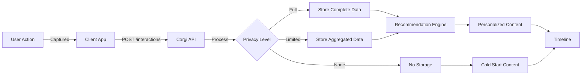
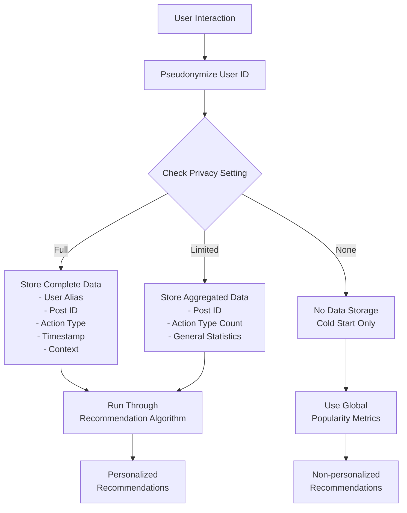
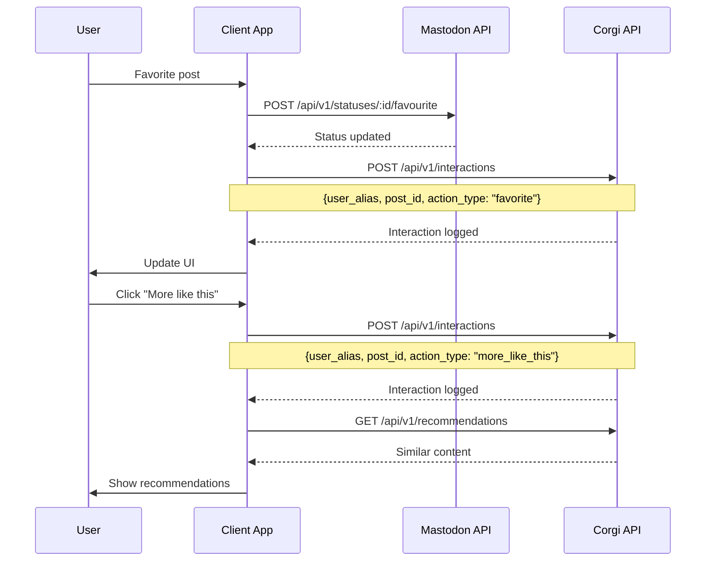

# Interactions API

The Interactions API lets you record and retrieve user engagement with posts. These interactions power Corgi's recommendation engine, building a personalized preference profile for each user while respecting privacy settings.

## Interaction Data Flow



The diagram above illustrates how user interactions flow through the Corgi system:

1. User interactions (favorites, reblogs, etc.) are captured by the client application
2. The client sends these interactions to the Corgi API
3. Interactions are processed according to the user's privacy settings
4. Depending on privacy level, different amounts of data are stored
5. The recommendation engine uses this data to generate personalized content
6. Users with no stored interaction data receive cold start recommendations

## Endpoints

<div class="corgi-endpoint">
  <div class="corgi-endpoint-header">
    <span class="corgi-endpoint-method post">POST</span>
    <span class="corgi-endpoint-path">/api/v1/interactions</span>
  </div>
  <div class="corgi-endpoint-body">
    <p>Records a user interaction with a post. Each interaction helps refine the recommendation engine's understanding of user preferences.</p>
    
    <h4>Request Body</h4>
    <table class="corgi-param-table">
      <thead>
        <tr>
          <th>Parameter</th>
          <th>Type</th>
          <th>Required</th>
          <th>Description</th>
        </tr>
      </thead>
      <tbody>
        <tr>
          <td>user_alias</td>
          <td>string</td>
          <td><span class="corgi-param-required">Required</span></td>
          <td>User identifier (pseudonymized for privacy). Example: <code>u_8f7d6e5c4b3a2190</code></td>
        </tr>
        <tr>
          <td>post_id</td>
          <td>string</td>
          <td><span class="corgi-param-required">Required</span></td>
          <td>ID of the post being interacted with. Example: <code>109876543211234567</code></td>
        </tr>
        <tr>
          <td>action_type</td>
          <td>string</td>
          <td><span class="corgi-param-required">Required</span></td>
          <td>Type of interaction. Must be one of: <code>favorite</code>, <code>reblog</code>, <code>bookmark</code>, <code>more_like_this</code>, <code>less_like_this</code>, <code>click</code>, <code>view</code>, <code>hide</code></td>
        </tr>
        <tr>
          <td>context</td>
          <td>object</td>
          <td>Optional</td>
          <td>Additional information about the interaction context</td>
        </tr>
        <tr>
          <td>context.source</td>
          <td>string</td>
          <td>Optional</td>
          <td>Where the interaction occurred. Examples: <code>timeline_home</code>, <code>timeline_public</code>, <code>profile</code>, <code>search</code></td>
        </tr>
        <tr>
          <td>context.recommended</td>
          <td>boolean</td>
          <td>Optional</td>
          <td>Whether the post was a recommendation (default: false)</td>
        </tr>
      </tbody>
    </table>

    <h4>Code Examples</h4>

    === "curl"

        ```bash
        # Track a user favorite interaction
        curl -X POST "https://api.corgi-recs.io/api/v1/interactions" \
          -H "Authorization: Bearer YOUR_API_KEY" \
          -H "Content-Type: application/json" \
          -d '{
            "user_alias": "u_8f7d6e5c4b3a2190",
            "post_id": "109876543211234567",
            "action_type": "favorite",
            "context": {
              "source": "timeline_home",
              "recommended": true
            }
          }'

        # Track explicit feedback for recommendations
        curl -X POST "https://api.corgi-recs.io/api/v1/interactions" \
          -H "Authorization: Bearer YOUR_API_KEY" \
          -H "Content-Type: application/json" \
          -d '{
            "user_alias": "u_8f7d6e5c4b3a2190",
            "post_id": "109876543211234567",
            "action_type": "more_like_this",
            "context": {
              "source": "recommended_timeline"
            }
          }'
        ```

    === "Python"

        ```python
        import requests

        def log_interaction(user_alias, post_id, action_type, api_key, context=None):
            """
            Log a user interaction with a post
            
            action_type: One of 'favorite', 'reblog', 'bookmark', 
                        'more_like_this', 'less_like_this', 'click', 'view', 'hide'
            """
            url = "https://api.corgi-recs.io/api/v1/interactions"
            headers = {
                "Authorization": f"Bearer {api_key}",
                "Content-Type": "application/json"
            }
            
            # Prepare the request body
            data = {
                "user_alias": user_alias,
                "post_id": post_id,
                "action_type": action_type
            }
            
            # Add context if provided
            if context:
                data["context"] = context
                
            # Send the request
            response = requests.post(url, json=data, headers=headers)
            
            if response.status_code == 200:
                return response.json()
            else:
                print(f"Error: {response.status_code}")
                print(response.text)
                return None
                
        # Example usage
        api_key = "YOUR_API_KEY"
        
        # Log a favorite
        log_interaction(
            user_alias="u_8f7d6e5c4b3a2190",
            post_id="109876543211234567",
            action_type="favorite",
            api_key=api_key,
            context={
                "source": "timeline_home",
                "recommended": True
            }
        )
        
        # Log explicit feedback
        log_interaction(
            user_alias="u_8f7d6e5c4b3a2190",
            post_id="109876543211234567",
            action_type="more_like_this",
            api_key=api_key,
            context={"source": "recommended_timeline"}
        )
        ```

    === "JavaScript"

        ```javascript
        async function logInteraction(userAlias, postId, actionType, apiKey, context = null) {
          /**
           * Log a user interaction with a post
           * 
           * @param {string} userAlias - The pseudonymized user ID
           * @param {string} postId - The Mastodon post ID
           * @param {string} actionType - One of: favorite, reblog, bookmark, more_like_this, less_like_this, click, view, hide
           * @param {string} apiKey - Your Corgi API key
           * @param {object} context - Additional context about the interaction (optional)
           */
          const url = "https://api.corgi-recs.io/api/v1/interactions";
          
          // Prepare the request body
          const data = {
            user_alias: userAlias,
            post_id: postId,
            action_type: actionType
          };
          
          // Add context if provided
          if (context) {
            data.context = context;
          }
          
          // Send the request
          const response = await fetch(url, {
            method: "POST",
            headers: {
              "Authorization": `Bearer ${apiKey}`,
              "Content-Type": "application/json"
            },
            body: JSON.stringify(data)
          });
          
          if (response.ok) {
            return await response.json();
          } else {
            console.error(`Error ${response.status}: ${response.statusText}`);
            return null;
          }
        }
        
        // Example usage
        const apiKey = "YOUR_API_KEY";
        
        // Log a favorite
        logInteraction(
          "u_8f7d6e5c4b3a2190",
          "109876543211234567",
          "favorite",
          apiKey,
          {
            source: "timeline_home",
            recommended: true
          }
        );
        
        // Log explicit feedback
        logInteraction(
          "u_8f7d6e5c4b3a2190",
          "109876543211234567",
          "more_like_this",
          apiKey,
          {source: "recommended_timeline"}
        );
        ```
    
    <h4>Response</h4>
    <p>Returns a confirmation of the logged interaction.</p>
    
    <div class="corgi-response-example">
      <div class="corgi-response-example-header">Example Response</div>
      <pre><code class="language-json">{
  "status": "success",
  "interaction_id": "int_7a6b5c4d3e2f1098",
  "user_alias": "u_8f7d6e5c4b3a2190",
  "post_id": "109876543211234567",
  "action_type": "favorite",
  "timestamp": "2025-03-15T14:22:11.000Z",
  "privacy_level": "pseudonymized"
}</code></pre>
    </div>
  </div>
</div>

<div class="corgi-endpoint">
  <div class="corgi-endpoint-header">
    <span class="corgi-endpoint-method get">GET</span>
    <span class="corgi-endpoint-path">/api/v1/interactions/{post_id}</span>
  </div>
  <div class="corgi-endpoint-body">
    <p>Retrieves interaction statistics for a specific post. This is useful for understanding engagement metrics.</p>
    
    <h4>Path Parameters</h4>
    <table class="corgi-param-table">
      <thead>
        <tr>
          <th>Parameter</th>
          <th>Type</th>
          <th>Description</th>
        </tr>
      </thead>
      <tbody>
        <tr>
          <td>post_id</td>
          <td>string</td>
          <td>ID of the post to get interaction statistics for. Example: <code>109876543211234567</code></td>
        </tr>
      </tbody>
    </table>

    <h4>Code Examples</h4>

    === "curl"

        ```bash
        # Get interaction stats for a post
        curl -X GET "https://api.corgi-recs.io/api/v1/interactions/109876543211234567" \
          -H "Authorization: Bearer YOUR_API_KEY"
        ```

    === "Python"

        ```python
        import requests

        def get_post_interactions(post_id, api_key):
            """Get interaction statistics for a post"""
            url = f"https://api.corgi-recs.io/api/v1/interactions/{post_id}"
            headers = {
                "Authorization": f"Bearer {api_key}"
            }
            
            response = requests.get(url, headers=headers)
            
            if response.status_code == 200:
                stats = response.json()
                print(f"Post has {stats['interaction_counts']['favorites']} favorites")
                return stats
            else:
                print(f"Error: {response.status_code}")
                return None
                
        # Example usage
        api_key = "YOUR_API_KEY"
        post_stats = get_post_interactions("109876543211234567", api_key)
        ```

    === "JavaScript"

        ```javascript
        async function getPostInteractions(postId, apiKey) {
          /**
           * Get interaction statistics for a post
           * 
           * @param {string} postId - The Mastodon post ID
           * @param {string} apiKey - Your Corgi API key
           */
          const url = `https://api.corgi-recs.io/api/v1/interactions/${postId}`;
          
          const response = await fetch(url, {
            headers: {
              "Authorization": `Bearer ${apiKey}`
            }
          });
          
          if (response.ok) {
            const stats = await response.json();
            console.log(`Post has ${stats.interaction_counts.favorites} favorites`);
            return stats;
          } else {
            console.error(`Error ${response.status}: ${response.statusText}`);
            return null;
          }
        }
        
        // Example usage
        const apiKey = "YOUR_API_KEY";
        const postStats = await getPostInteractions("109876543211234567", apiKey);
        ```
    
    <h4>Response</h4>
    <p>Returns statistics about interactions with the specified post.</p>
    
    <div class="corgi-response-example">
      <div class="corgi-response-example-header">Example Response</div>
      <pre><code class="language-json">{
  "post_id": "109876543211234567",
  "interaction_counts": {
    "favorites": 42,
    "reblogs": 12,
    "replies": 7,
    "bookmarks": 5,
    "more_like_this": 3,
    "less_like_this": 1,
    "clicks": 18,
    "views": 208
  },
  "interactions": [
    {
      "action_type": "favorite",
      "count": 42
    },
    {
      "action_type": "reblog",
      "count": 12
    },
    {
      "action_type": "bookmark",
      "count": 5
    },
    {
      "action_type": "more_like_this",
      "count": 3
    },
    {
      "action_type": "less_like_this",
      "count": 1
    }
  ],
  "engagement_rate": 0.37,
  "last_interaction": "2025-03-15T22:14:53.000Z"
}</code></pre>
    </div>
  </div>
</div>

<div class="corgi-endpoint">
  <div class="corgi-endpoint-header">
    <span class="corgi-endpoint-method get">GET</span>
    <span class="corgi-endpoint-path">/api/v1/interactions/user/{user_alias}</span>
  </div>
  <div class="corgi-endpoint-body">
    <p>Retrieves a user's recent interactions. This provides insight into a user's engagement patterns.</p>
    
    <h4>Path Parameters</h4>
    <table class="corgi-param-table">
      <thead>
        <tr>
          <th>Parameter</th>
          <th>Type</th>
          <th>Description</th>
        </tr>
      </thead>
      <tbody>
        <tr>
          <td>user_alias</td>
          <td>string</td>
          <td>Pseudonymized user ID. Example: <code>u_8f7d6e5c4b3a2190</code></td>
        </tr>
      </tbody>
    </table>
    
    <h4>Query Parameters</h4>
    <table class="corgi-param-table">
      <thead>
        <tr>
          <th>Parameter</th>
          <th>Type</th>
          <th>Default</th>
          <th>Description</th>
        </tr>
      </thead>
      <tbody>
        <tr>
          <td>limit</td>
          <td>integer</td>
          <td>20</td>
          <td>Maximum number of interactions to return (max: 100). Example: <code>50</code></td>
        </tr>
        <tr>
          <td>action_type</td>
          <td>string</td>
          <td>null</td>
          <td>Filter by interaction type. Example: <code>favorite</code></td>
        </tr>
        <tr>
          <td>since</td>
          <td>string</td>
          <td>null</td>
          <td>Return interactions after this ISO timestamp. Example: <code>2025-03-01T00:00:00Z</code></td>
        </tr>
      </tbody>
    </table>
    
    <h4>Response</h4>
    <p>Returns a list of user interactions.</p>
    
    <div class="corgi-response-example">
      <div class="corgi-response-example-header">Example Response</div>
      <pre><code class="language-json">{
  "user_alias": "u_8f7d6e5c4b3a2190",
  "total_count": 142,
  "returned_count": 20,
  "interactions": [
    {
      "interaction_id": "int_7a6b5c4d3e2f1098",
      "post_id": "109876543211234567",
      "action_type": "favorite",
      "timestamp": "2025-03-15T14:22:11.000Z",
      "context": {
        "source": "timeline_home",
        "recommended": true
      }
    },
    {
      "interaction_id": "int_0f1e2d3c4b5a6789",
      "post_id": "109876123456789012",
      "action_type": "reblog",
      "timestamp": "2025-03-15T13:52:08.000Z",
      "context": {
        "source": "profile"
      }
    },
    {
      "interaction_id": "int_b0a9c8d7e6f5abcd",
      "post_id": "109875567890123456",
      "action_type": "more_like_this",
      "timestamp": "2025-03-15T12:30:45.000Z",
      "context": {
        "source": "recommended_timeline"
      }
    }
    // Additional interactions omitted for brevity
  ]
}</code></pre>
    </div>
  </div>
</div>

## Interaction Types

Corgi tracks these interaction types:

| Type | Description | Effect on Recommendations |
|------|-------------|---------------------------|
| `favorite` | User favorites/likes a post | Strong positive signal |
| `reblog` | User boosts/reblogs a post | Strong positive signal |
| `bookmark` | User bookmarks a post | Medium positive signal |
| `more_like_this` | User explicitly requests similar content | Very strong positive signal |
| `less_like_this` | User explicitly requests less similar content | Strong negative signal |
| `click` | User clicks on a post or link | Weak positive signal |
| `view` | User views post details | Neutral signal |
| `hide` | User hides or dismisses content | Weak negative signal |

## Privacy Considerations

<div class="corgi-callout">
  <div class="corgi-callout-title">
    <svg xmlns="http://www.w3.org/2000/svg" viewBox="0 0 24 24" width="24" height="24" fill="currentColor"><path d="M12 22C6.477 22 2 17.523 2 12S6.477 2 12 2s10 4.477 10 10-4.477 10-10 10zm0-2a8 8 0 1 0 0-16 8 8 0 0 0 0 16zm-1-5h2v2h-2v-2zm0-8h2v6h-2V7z"/></svg>
    Privacy by Design
  </div>
  <p>All user identifiers are pseudonymized using a one-way hash before storage. The level of interaction data stored depends on the user's privacy settings:</p>
  <ul>
    <li><strong>Full:</strong> All interactions are stored (most personalized)</li>
    <li><strong>Limited:</strong> Only aggregated interaction counts are stored</li>
    <li><strong>None:</strong> No interaction data is stored (no personalization)</li>
  </ul>
</div>

### Interaction Privacy Processing



The diagram above illustrates how Corgi processes interaction data with privacy in mind:

1. **Pseudonymization**: All user IDs are converted to aliases using a one-way hash
2. **Privacy-Based Processing**:
   - Full privacy: Stores detailed data for maximum personalization
   - Limited privacy: Stores only aggregated statistics
   - None: Stores no user-specific data
3. **Recommendation Generation**: 
   - Personalized recommendations use the processed data according to privacy level
   - Users with no stored data receive non-personalized, popularity-based content

## Integration Examples

### Client Integration Architecture



The sequence diagram above shows the typical flow between a client application, the Mastodon API, and the Corgi API:

1. When a user interacts with a post (like favoriting it), the client app first updates the Mastodon API
2. Then, the client logs this interaction with the Corgi API
3. For explicit feedback like "More like this", the client logs this with Corgi and can immediately request recommendations
4. The user's privacy settings determine how this data is processed behind the scenes

### Tracking Favorites in a Client App

```javascript
// Event listener for favorite button
document.querySelectorAll('.favorite-button').forEach(button => {
  button.addEventListener('click', async (event) => {
    const postId = event.target.dataset.postId;
    const isRecommendation = event.target.dataset.isRecommendation === 'true';
    
    // Call Mastodon API to favorite the post
    await mastodonApi.favorite(postId);
    
    // Log the interaction with Corgi
    await logInteraction(
      userId,
      postId,
      'favorite',
      apiKey,
      {
        source: 'timeline_home',
        recommended: isRecommendation
      }
    );
  });
});
```

### Using Explicit Feedback Buttons

```html
<div class="recommendation-feedback">
  <button class="more-button" data-post-id="109876543211234567">
    More like this
  </button>
  <button class="less-button" data-post-id="109876543211234567">
    Less like this
  </button>
</div>

<script>
  // Event listeners for feedback buttons
  document.querySelectorAll('.more-button').forEach(button => {
    button.addEventListener('click', async (event) => {
      const postId = event.target.dataset.postId;
      
      // Log positive feedback
      await logInteraction(
        userId,
        postId,
        'more_like_this',
        apiKey,
        {source: 'recommended_timeline'}
      );
      
      showFeedbackConfirmation('Thanks! We'll show more content like this.');
    });
  });
  
  document.querySelectorAll('.less-button').forEach(button => {
    button.addEventListener('click', async (event) => {
      const postId = event.target.dataset.postId;
      
      // Log negative feedback
      await logInteraction(
        userId,
        postId,
        'less_like_this',
        apiKey,
        {source: 'recommended_timeline'}
      );
      
      showFeedbackConfirmation('Got it! We'll show less content like this.');
    });
  });
</script>
```

## Related Resources

- [Privacy API](privacy.md) - Set user privacy levels and manage data
- [Recommendations API](recommendations.md) - Get personalized content recommendations
- [Concepts: Privacy Design](../concepts/privacy.md) - Learn about Corgi's privacy architecture