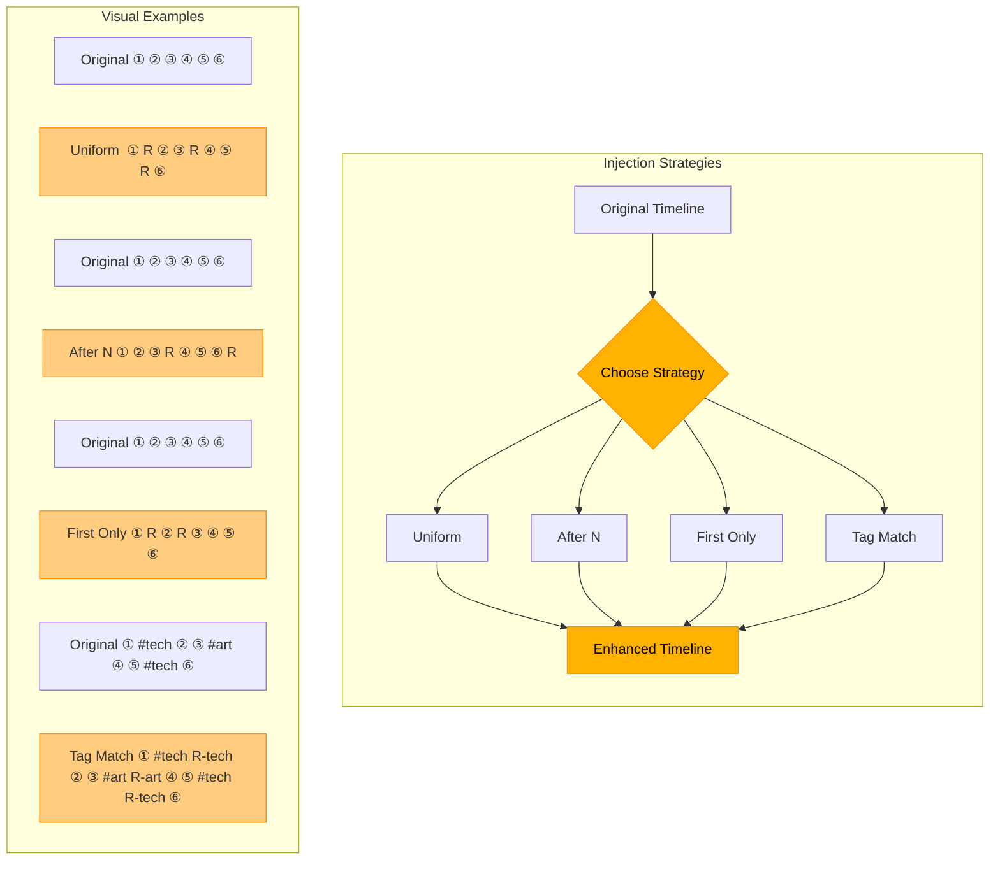

# Timeline Injection API

The Timeline Injection API provides enhanced timeline capabilities that seamlessly blend real Mastodon posts with injected recommended or synthetic content. This approach allows for a more personalized and engaging user experience while maintaining Mastodon compatibility.

## Overview

The timeline injection system works by:

1. Retrieving real posts from the upstream Mastodon instance
2. Loading injectable posts from a recommendation engine or cold start dataset
3. Using a configurable injection strategy to determine placement
4. Merging the timelines using the `inject_into_timeline` utility
5. Preserving chronological order and adding metadata for client-side rendering

## Endpoints

### GET /api/v1/timelines/home

Enhanced version of the standard Mastodon timeline endpoint with injection capabilities.

#### Request Parameters

| Parameter | Type | Required | Description |
|-----------|------|----------|-------------|
| `limit` | Integer | No | Maximum number of posts to return (default: 20) |
| `strategy` | String | No | Injection strategy to use: `uniform`, `after_n`, `first_only`, or `tag_match` |
| `inject` | Boolean | No | Whether to inject posts (default: true) |

#### Response

```json
{
  "timeline": [
    {
      "id": "109909109008830925",
      "created_at": "2025-04-19T14:00:10.985Z",
      "content": "<p>Post content here</p>",
      "account": {
        "id": "109909109008830925",
        "username": "example",
        "display_name": "Example User",
        "url": "https://mastodon.social/@example"
      },
      // Other standard Mastodon post fields
      
      // Additional fields for injected posts:
      "injected": true,  // Only present for injected posts
      "is_real_mastodon_post": false,
      "is_synthetic": false,
      "injection_metadata": {
        "source": "recommendation_engine",
        "strategy": "personalized",
        "explanation": "Recommended based on your recent interests in #python and #opensource",
        "score": 0.87
      }
    },
    // More posts...
  ],
  "metadata": {
    "injection": {
      "strategy": "uniform",
      "injected_count": 5,
      "source": "personalized",
      "processing_time_ms": 42
    }
  }
}
```

#### Response Fields

The response includes standard Mastodon timeline posts plus:

- `injected` - Boolean flag (true for injected posts)
- `injection_metadata` - Object with detailed information about the recommendation:
  - `source` - Source of the recommendation (`recommendation_engine`, `timeline_injector`, etc.)
  - `strategy` - Strategy used for recommendation (`personalized`, `tag_match`, etc.)
  - `explanation` - Human-readable explanation for why this post was recommended
  - `score` - Numerical score indicating recommendation strength (0-1 range)
- `metadata` - Object containing information about the injection process:
  - `injection.strategy` - The strategy used for injection
  - `injection.injected_count` - Number of posts injected
  - `injection.source` - Source of injected posts (`cold_start` or `personalized`)
  - `injection.processing_time_ms` - Processing time in milliseconds

If injection was not performed, the metadata will include:
```json
"metadata": {
  "injection": {
    "performed": false,
    "reason": "disabled"  // or "no_posts_available"
  }
}
```

## Injection Strategies

The following strategies are available for post injection:



### `uniform`

Evenly distributes injected posts throughout the timeline.

```json
{
  "type": "uniform",
  "max_injections": 5,
  "shuffle_injected": true
}
```

### `after_n`

Inserts an injected post after every N real posts.

```json
{
  "type": "after_n",
  "n": 3,
  "max_injections": 5,
  "shuffle_injected": true
}
```

### `first_only`

Only injects posts in the first portion of the timeline, ideal for new user onboarding.

```json
{
  "type": "first_only",
  "max_injections": 3,
  "shuffle_injected": true
}
```

### `tag_match`

Inserts posts after real posts that have matching hashtags, for contextual relevance.

```json
{
  "type": "tag_match",
  "max_injections": 5,
  "shuffle_injected": true,
  "inject_only_if_gap_minutes": 10
}
```

## Additional Strategy Options

All strategies support these additional configuration options:

| Option | Type | Description |
|--------|------|-------------|
| `max_injections` | Integer | Maximum number of posts to inject |
| `shuffle_injected` | Boolean | Whether to randomize the order of injection candidates |
| `inject_only_if_gap_minutes` | Integer | Only inject if there's a minimum time gap between posts |

## Session-Based Behavior

The timeline injection system adapts based on the user's session state and interaction history:

- **Anonymous users**: Receive cold start content with the `uniform` strategy
- **New users** (< 5 interactions): Receive cold start content with the `first_only` strategy for front-loaded recommendations
- **Regular users**: Receive personalized recommendations from the recommendation engine with the `tag_match` strategy for relevance

The recommendation engine dynamically determines user status and selects the appropriate content source:

1. For anonymous or new users: Uses the cold start dataset
2. For returning users with sufficient activity: Generates real-time personalized recommendations based on:
   - Past interactions
   - Content engagement metrics
   - Author preferences
   - Content recency

## Client-Side Integration

Clients should handle injected posts by:

1. Checking for the `injected: true` flag on posts
2. Optionally rendering injected posts differently (e.g., with a recommendation badge)
3. Using the `injection_metadata` object to display helpful context about why a post was recommended
4. Preserving the ability to interact with injected posts normally

Example client implementation showing a recommendation badge:

```javascript
function renderTimelinePost(post) {
  const postElement = document.createElement('div');
  postElement.classList.add('timeline-post');
  
  // If this is an injected post, add badge and styling
  if (post.injected) {
    // Add recommendation badge
    const badge = document.createElement('div');
    badge.classList.add('recommendation-badge');
    
    // Use the explanation from metadata if available
    if (post.injection_metadata && post.injection_metadata.explanation) {
      badge.textContent = post.injection_metadata.explanation;
    } else {
      badge.textContent = "Recommended for you";
    }
    
    postElement.appendChild(badge);
    postElement.classList.add('injected-post');
  }
  
  // Render the rest of the post normally...
  // ...
  
  return postElement;
}
```

## Error Handling

The endpoint gracefully handles errors:

- If injected posts cannot be loaded, only real posts are returned
- If real posts cannot be retrieved, injected posts are returned as a fallback
- If both fail, an empty timeline is returned with appropriate error metadata

## Logging and Monitoring

The system logs detailed information about each injection operation:

- Number of injected posts
- Strategy used
- Processing time
- Success/failure status

This information can be used for monitoring and optimizing the injection process.