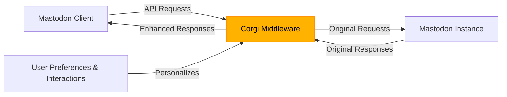

# Welcome to Corgi

<div style="text-align: center; margin-bottom: 3rem;">
  <h2 style="margin-top: 0; font-weight: 500; color: var(--md-corgi-neutral-600);">Small body. Big brain. Portable recs that follow you anywhere.</h2>
</div>

Corgi is a privacy-aware recommendation engine for the Fediverse that works as a middleware layer between any Mastodon client and server.

## Who is Corgi for?

- **Mastodon users** who want better content discovery without algorithmic manipulation
- **Developers** building Fediverse clients who need a recommendation layer
- **Instance operators** looking to enhance their community's experience

## Choose your path

<div class="corgi-grid">
  <div class="corgi-grid-item">
    <h3>🔎 Interactive API Explorer</h3>
    <p>Test our endpoints right in your browser with Swagger UI.</p>
    <a href="/api/v1/docs" class="corgi-button">Try Swagger UI</a>
  </div>
  
  <div class="corgi-grid-item">
    <h3>📚 API Reference</h3>
    <p>Explore our complete API documentation with ReDoc.</p>
    <a href="/api/v1/docs/redoc" class="corgi-button">View ReDoc</a>
  </div>
  
  <div class="corgi-grid-item">
    <h3>💻 GitHub Repo</h3>
    <p>View source code, contribute, or self-host Corgi.</p>
    <a href="https://github.com/andrewnordstrom/corgi-recommender-service" class="corgi-button">Open GitHub</a>
  </div>
</div>

## Try it in 5 minutes

Enhance your Mastodon timeline with personalized recommendations:

=== "curl"

    ```bash
    # Get enhanced timeline with recommendations
    curl -X GET "https://api.corgi-recs.io/api/v1/timelines/home" \
      -H "Authorization: Bearer YOUR_MASTODON_TOKEN" \
      -H "X-Mastodon-Instance: mastodon.social"
    ```

=== "Python"

    ```python
    import requests

    # Get enhanced timeline with recommendations
    response = requests.get(
        "https://api.corgi-recs.io/api/v1/timelines/home",
        headers={
            "Authorization": "Bearer YOUR_MASTODON_TOKEN",
            "X-Mastodon-Instance": "mastodon.social"
        }
    )
    
    timeline = response.json()
    for post in timeline:
        if post.get("is_recommendation"):
            print(f"✨ Recommended: {post['account']['display_name']}: {post['content'][:50]}...")
        else:
            print(f"Regular: {post['account']['display_name']}: {post['content'][:50]}...")
    ```

## How It Works

Corgi transparently proxies your Mastodon API requests, analyzing your interactions to learn your preferences. When you request your home timeline, Corgi enhances it with personalized recommendations, seamlessly blended with your regular feed.



<div class="corgi-card">
  <h3 style="margin-top: 0;">🐾 Corgi in action</h3>
  <p>When you favorite a post, Corgi remembers that you liked it. Later, when new content appears that's similar or from the same author, Corgi makes sure it appears in your timeline—even if the Mastodon algorithm would have buried it.</p>
</div>

## Core Features

- **Transparent Proxying** — All Mastodon API requests pass through Corgi and are enhanced as needed
- **Interaction Tracking** — Favorites, boosts, and bookmarks inform the recommendation engine
- **Privacy Controls** — Set your tracking level (full, limited, or none) based on your comfort
- **Recommendation API** — Direct access to recommendation data for custom integrations
- **Blended Timelines** — Recommendations intelligently mixed with your regular home timeline

## Getting Started

Ready to enhance your Fediverse experience? Start with our [Quickstart guide](quickstart.md) to get Corgi running in minutes.

<div class="corgi-callout">
  <div class="corgi-callout-title">
    <svg xmlns="http://www.w3.org/2000/svg" viewBox="0 0 24 24" width="24" height="24" fill="currentColor"><path d="M12 22C6.477 22 2 17.523 2 12S6.477 2 12 2s10 4.477 10 10-4.477 10-10 10zm0-2a8 8 0 1 0 0-16 8 8 0 0 0 0 16zM11 7h2v2h-2V7zm0 4h2v6h-2v-6z"/></svg>
    Corgi works client-agnostic
  </div>
  <p>Just swap the API URL in your favorite Mastodon client—no code changes needed! Works with Elk, Ivory, Ice Cubes, and any other client that allows custom API endpoints.</p>
</div>