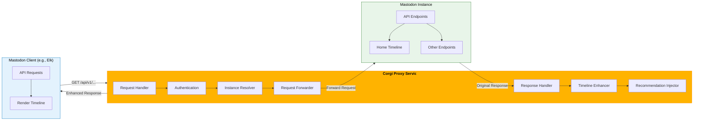

# Proxy Middleware

The Corgi Recommender Service includes a powerful middleware proxy that enables seamless integration with existing Mastodon clients. This allows the recommendation service to enhance the user experience without requiring clients to implement custom API calls.

## How It Works

The proxy acts as a transparent intermediary between Mastodon clients and instances:

1. Clients connect to the Corgi service instead of directly to a Mastodon instance
2. The proxy forwards all requests to the appropriate Mastodon instance
3. For specific endpoints (like the home timeline), the proxy enhances the response with personalized recommendations
4. The client receives a response that appears to come directly from Mastodon, with added content



## Configuration

### Environment Variables

| Variable | Description | Default |
|----------|-------------|---------|
| `DEFAULT_MASTODON_INSTANCE` | Fallback Mastodon instance URL | https://mastodon.social |
| `RECOMMENDATION_BLEND_RATIO` | Ratio of recommendations to include (0.0-1.0) | 0.3 |
| `PROXY_TIMEOUT` | Timeout for proxy requests in seconds | 10 |
| `FLASK_ENV` | When set to "development", logs additional proxy info to stdout | production |

### User Identity Setup

For the proxy to work correctly, users must be linked to their Mastodon accounts. This can be done using the included utility:

```bash
# Link a user to a Mastodon instance
./tools/link_user.py --user-id user123 --instance mastodon.social --token "your_oauth_token"

# List all linked users
./tools/link_user.py --list
```

## Endpoints

### Main Proxy Endpoint

```
/api/v1/<path:path>
```

This catch-all endpoint proxies any request to the corresponding Mastodon API endpoint.

### Debug Endpoints

```
/api/v1/status
```

Returns the current status of the proxy service.

```
/api/v1/instance
```

Shows what instance would be detected for the current request and other debug information.

### Metrics Endpoint

```
/api/v1/proxy/metrics
```

Returns metrics about the proxy, including:
- Total number of requests processed
- Number of enriched timelines
- Average response time
- Number of failures
- Recent errors

To reset metrics, use:
```
/api/v1/proxy/metrics?reset=true
```

## Instance Resolution

The proxy determines which Mastodon instance to forward requests to in the following order:

1. `X-Mastodon-Instance` header
2. `instance` query parameter
3. Database lookup based on the OAuth token
4. Default instance from configuration

## Timeline Blending

When a request to `/api/v1/timelines/home` is received, the proxy:

1. Authenticates the user
2. Forwards the request to the Mastodon instance
3. Retrieves personalized recommendations for the user
4. Blends the recommendations into the timeline response
5. Adds a `X-Corgi-Recommendations` header with information about injected recommendations

Recommendations are distributed throughout the timeline based on the blend ratio setting.

## Privacy Considerations

The proxy respects user privacy settings and only injects recommendations for users who have consented to full data collection (privacy level "full").

## Client Configuration

To use the Corgi proxy with a Mastodon client:

1. Configure the client to use the Corgi service URL instead of a Mastodon instance
2. Link the user's Mastodon account using the link_user.py tool
3. Ensure proper OAuth authentication is in place

For Elk, simply point the API URL to your Corgi service instead of the user's Mastodon instance.

## Observability and Diagnostics

### Logging

The proxy logs detailed information about each request to:
- `logs/proxy.log` (rotated when size exceeds 10 MB)
- Console output when `FLASK_ENV=development`

Log entries include:
- Request method, path, and target instance
- Authentication status
- Privacy mode
- Response times for upstream requests
- Status codes and errors
- Enrichment status and recommendation counts

### Diagnostic CLI

A command-line diagnostic tool is included to test and monitor the proxy:

```bash
# Basic usage - ping home timeline
./tools/proxy_diagnostics.py

# Test with a specific user
./tools/proxy_diagnostics.py --user-id user123

# Test with authentication token
./tools/proxy_diagnostics.py --token "your_oauth_token"

# Test against a specific instance
./tools/proxy_diagnostics.py --instance fosstodon.org

# Test a different endpoint
./tools/proxy_diagnostics.py --path statuses/123456

# Show detailed headers and response
./tools/proxy_diagnostics.py --show-headers --dump-response

# Get JSON output for integration with other tools
./tools/proxy_diagnostics.py --output json
```

The tool outputs information about:
- Target instance used
- Authentication status
- Response time
- Number of recommendations injected
- Response headers (with --show-headers)
- Full response data (with --dump-response)

## Testing the Proxy

You can test the proxy using `curl`:

```bash
# Test proxy status
curl -i http://localhost:5000/api/v1/proxy/status

# Test instance detection
curl -i -H "X-Mastodon-Instance: mastodon.social" http://localhost:5000/api/v1/proxy/instance

# Test timeline (will be anonymous without auth)
curl -i -H "X-Mastodon-Instance: mastodon.social" http://localhost:5000/api/v1/timelines/home

# Test timeline with auth token
curl -i -H "Authorization: Bearer YOUR_TOKEN" -H "X-Mastodon-Instance: mastodon.social" http://localhost:5000/api/v1/timelines/home

# Check proxy metrics
curl -i http://localhost:5000/api/v1/proxy/metrics
```

## Security Notes

- The proxy forwards authentication tokens directly to the Mastodon instance
- User tokens should be stored securely in the database
- Consider implementing additional encryption for sensitive data
- Use HTTPS for production deployments
- Proxy logs are sanitized to avoid logging sensitive token data